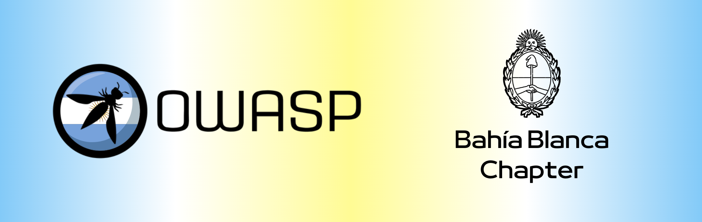

---

layout: col-sidebar
title: OWASP Bahia Blanca
tags: Argentina
region: South America
country: Argentina
meetup-group:

---

## Bienvenidos

El objetivo del capítulo de OWASP Bahía Blanca es fomentar una comunidad enfocada en la seguridad de la información. OWASP es una organización internacional sin fines de lucro que ofrece software, metodologías y documentación de rigurosa calidad bajo licencias de código abierto, promoviendo así la colaboración y el acceso abierto a recursos profesionales en el ámbito de la seguridad informática.

## Colaboración y proyectos

Estamos inmersos en el desarrollo de proyectos futuros y, para aquellos que deseen colaborar, les animamos a comunicarse con los lideres del capítulo.
